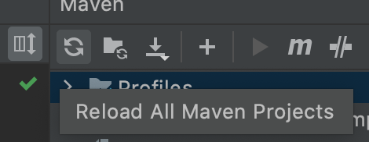

# GraphQL JVM Client Examples #

GraphQL JVM Client examples. Java, Java / Kotlin, Kotlin

## Playground  ##

- GraphQL Service [http://localhost:8080/playground](http://localhost:8080/playground)
- GraphQL Kotlin Client [http://localhost:8081/playground](http://localhost:8081/playground)
- GraphQL Java/Kotlin Client [http://localhost:8082/playground](http://localhost:8082/playground)
- GraphQL Java Client [http://localhost:8083/playground](http://localhost:8083/playground)

## GraphiQL  ##

- GraphQL Service [http://localhost:8080/graphiql](http://localhost:8080/graphiql)
- GraphQL Kotlin Client [http://localhost:8081/graphiql](http://localhost:8081/graphiql)
- GraphQL Java/Kotlin Client [http://localhost:8082/graphiql](http://localhost:8082/graphiql)
- GraphQL Java Client [http://localhost:8083/graphiql](http://localhost:8083/graphiql)

## Query ##

### Query on Client ###

```
{
  products{
    id
    name
    description
  }
}
```

```
query getProduct($id: ID!) {
  product(id: $id) {
    id
    name
    description
  }
}

Variables:
{
  "id": "1"
}
```

### Query on Service ###

```
{
  products{
    id
    name
    description
    price
  }
}
```

### Run application ###

Build projects (incl. code generation)

```
./mvnw verify 
```

Build projects (incl. code generation) without test

```
./mvnw verify -DskipTests
```

Start service

```

./mvnw spring-boot:run -f product-service/pom.xml

```

Start client

```
./mvnw spring-boot:run -f product-client-kotlin/pom.xml
./mvnw spring-boot:run -f product-client-java-kotlin/pom.xml
./mvnw spring-boot:run -f product-client-java/pom.xml

```

### Troubleshooting ###

On compile error use maven reload

IntelliJ:


